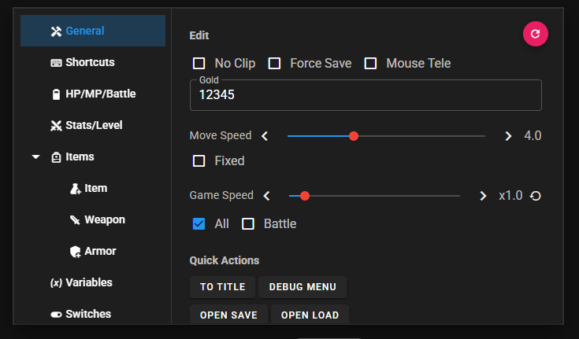
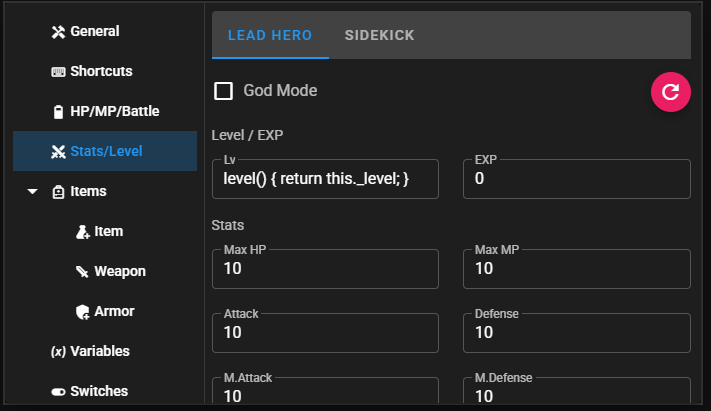
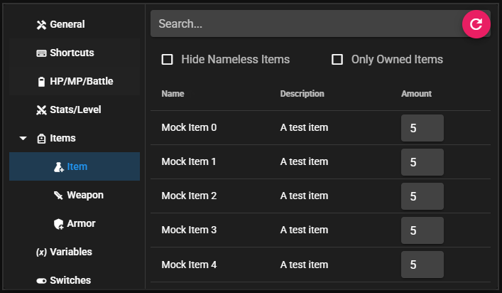
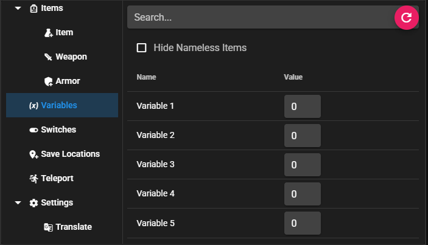
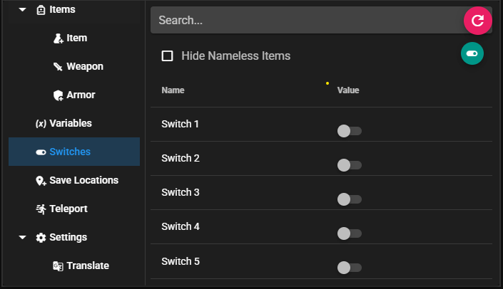
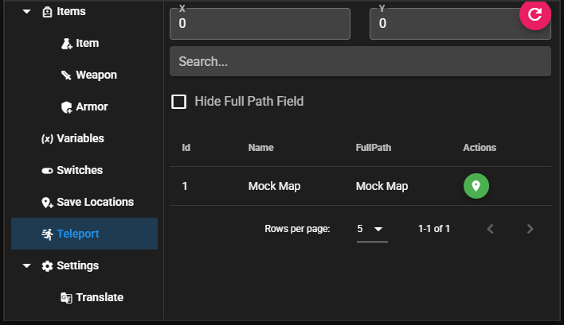
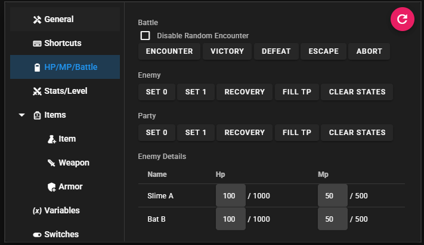
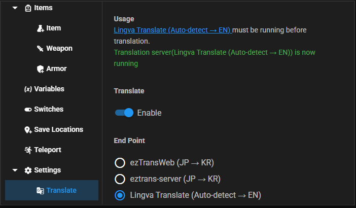

# Features

This page is the quick reference for the main panels and tools exposed by the cheat UI.

## Open the cheat UI

Press <kbd>Ctrl</kbd> + <kbd>C</kbd> to toggle the main overlay. By default it appears in the upper-right corner of the game window and stays semi-transparent until you hover over it.

You can rebind that shortcut from the [Shortcuts](/guide/features/shortcuts) page.

## General tab

Utility controls that affect the running game immediately.

| Feature | What it does |
| --- | --- |
| Force Save | Bypasses game-level save restrictions so you can save where the game normally blocks it |
| Mouse Teleport | Lets you jump by clicking the map when the toggle is enabled |
| Debug Console | Opens NW.js developer tools for inspection and debugging |
| Debug Menu | Opens the built-in RPG Maker debug menu |
| Pop Out Window | Moves the cheat UI into a separate standalone window in NW.js |

## Stats tab

Change live party values without opening built-in game menus.

| Field | What it affects |
| --- | --- |
| HP / MP | Current and max values for party members |
| Gold | Party gold amount |
| Movement speed | Walk and run speed behavior |
| Level | Actor level adjustments |

## Items tab

- Search for items by name.
- Add or remove items, weapons, and armors.
- Set quantities directly instead of editing through event commands.

## Variables tab

Read and update game variables by name or ID. This is useful for event flags, progression values, and debugging route-specific behavior.

## Switches tab

Toggle boolean game switches in real time. Search helps when games have hundreds of named switches.

## Map and teleport tools

| Feature | What it does |
| --- | --- |
| Save location | Stores current map ID and coordinates |
| Recall location | Returns you to a saved point |
| Manual teleport | Moves you to entered map and coordinate values |
| No Clip | Lets the player move through blocked terrain |

## Battle tools

| Feature | What it does |
| --- | --- |
| Force victory | Ends the battle as a win |
| Force defeat | Triggers defeat immediately |
| Force escape | Leaves the battle as an escape |
| Force abort | Ends the battle without normal completion flow |
| Fill party TP | Sets party TP to max |
| Fill enemy TP | Sets enemy TP to max |
| Set party HP | Pushes party HP to low or full values |
| Set enemy HP | Pushes enemy HP to low or full values |

## Speed and encounter controls

- Speed multiplier ranges from `x0.1` to `x10`.
- Speed changes can apply globally or only in battle, depending on the selected setting.
- Encounter controls let you disable random encounters or force one immediately.

## Shortcuts tab

Bind custom key combinations for common actions such as:

- Quick save and quick load
- Save and load windows
- Toggle no-clip
- Edit party HP
- Edit enemy HP
- Return to title

See [Shortcuts](/guide/features/shortcuts) for the full shortcut workflow.

## Translate tab

The translation system can batch-translate and cache multiple categories of game text.

| Capability | Details |
| --- | --- |
| Supported targets | Items, weapons, armors, actors, maps, system terms, variables, switches, and dialogue-related text |
| Backends | Lingva, local Lingva nodes, Ollama, OpenAI-compatible APIs, and Gemini-style endpoints |
| Cache behavior | Translations are stored locally so repeated strings do not need to be fetched again |
| Runtime application | Cached results are applied to game data and text rendering hooks during gameplay |

For setup instructions, continue to [Translation Usage](/guide/translation/translation-usage).
