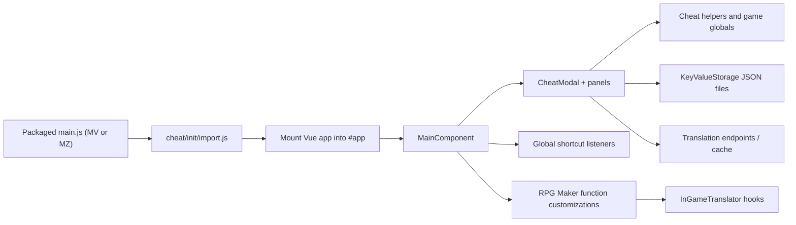

# Architecture

This project is a fork of an older RPG Maker cheat plugin that now carries additional translation features, tooling, and documentation. The main challenge for contributors is that the app does not look like a modern bundled web app. It is a browser-like overlay injected into an RPG Maker MV or MZ game running inside NW.js.

This page explains the high-level design first. For folder-level details, continue to [Repository Structure](/guide/technical/repository-structure). For runtime and translation internals, see [Runtime and Data Flow](/guide/technical/runtime-and-data-flow).

## System summary

At a high level, the project has four layers:

1. Packaging and bootstrap files that are copied into a target game.
2. A Vue 2 and Vuetify 2 UI that renders the cheat overlay.
3. Helper modules that patch RPG Maker and NW.js behavior.
4. Developer tooling for preview, dev-sync, documentation, and releases.

## High-level flow

## Boot and injection model

The plugin does not run as a normal RPG Maker plugin entry in `plugins.js`. Instead, it modifies the game's startup sequence by replacing the game's `main.js` with an injected version.

- The injected templates live under `cheat-engine/www/_cheat_initialize/`.
- There are separate templates for MV and MZ because the two engines boot differently.
- Those templates load `cheat/init/import.js` before the standard RPG Maker scripts.
- `cheat/init/import.js` creates the app root, injects CSS and libraries, and then loads `cheat/init/setup.js`.
- `cheat/init/setup.js` mounts the Vue app and renders `MainComponent`.

This is the reason installation requires replacing the game's original `main.js`.

## UI model

The UI is written in plain JavaScript modules, not single-file Vue components.

- `MainComponent.js` is the top-level controller.
- `CheatModal.js` defines the left navigation tree and panel container.
- `cheat/panels/` contains the concrete feature panels such as stats, items, shortcuts, teleport, and translation.
- shared panel conventions now live under `cheat/js/panels/` for reusable panel-safe state shaping and translation display helpers.
- The UI listens for global key events so the overlay can be opened while gameplay is running.
- In NW.js, the UI can also open as a separate window using `window.html` plus `window-init.js`.

Because the game and the UI share the same process, panel code can read and write RPG Maker globals directly.

## Engine integration model

The fork customizes RPG Maker behavior by patching existing engine functions at runtime.

Examples visible in the repo:

- Mouse and wheel handling is patched in `customize_functions.js`.
- Input shortcuts are routed through `GlobalShortcut.js`.
- Overlay entry points are exposed through helper objects such as `GeneralCheat`.
- In-game translation hooks patch classes like `Window_Message`, `Window_Base`, `Game_Actor`, and related display methods.

This means contributors should think in terms of runtime monkey-patching rather than extension hooks provided by a framework.

## Persistence model

The main persistence abstraction is `KeyValueStorage`.

- In NW.js, it stores JSON on disk using Node's `fs`.
- In browser preview mode, it falls back to `localStorage`.
- Settings such as translation configuration, shortcut data, and cached translations are persisted through this mechanism.

One important rule applies across the UI:

::: danger Serialization rule
Do not place live RPG Maker objects directly into reactive Vue state when those objects may be saved by the game. Vue observer metadata can break RPG Maker's save serialization.
:::

Safe pattern:

- Store primitive IDs or lightweight values in component state.
- Resolve `$gameActors`, `$gameParty`, `$dataItems`, `$gameVariables`, and similar globals only when reading or writing.

## Translation architecture

The translation system has two separate responsibilities:

1. Collect and translate text in bulk.
2. Apply cached translations during gameplay.

Main modules:

- `TranslateHelper.js`: translator orchestration, batching flow, and extraction entry points.
- `translation/TranslationConfig.js`: endpoint definitions and chunking limits.
- `translation/TranslationBank.js`: cached translation storage and translation metrics.
- `translation/TranslationBatching.js`: chunk sizing, batch splitting, recursive fallback, and Lingva batch concurrency.
- `translation/TranslationBasicRequest.js`: shared request helper for simple GET/POST translation endpoints.
- `translation/TranslationLingvaRequest.js`: shared request helper for Lingva and Lingva-style fallback handling.
- `translation/TranslationLlmRequest.js`: shared request helper for OpenAI-compatible and local LLM translation endpoints.
- `translation/TranslationExtractors.js`: game-data and event-text extraction helpers.
- `translation/TranslationPool.js`: builds the uncached translation pool from extracted target lists.
- `translation/TranslationWorkflow.js`: runs category-by-category translation work and progress updates for uncached strings.
- `translation/TranslateSettings.js`: persisted translation settings and endpoint selection state.
- `translation/TranslateProgress.js`: shared progress state used by the translation UI.
- `runtime/RuntimeEnv.js`: small MV/MZ and NW.js environment helpers used by runtime modules.
- `storage/KeyValueStorage.js`: shared JSON/localStorage persistence helper used by settings and caches.
- `shortcuts/ShortcutConfig.js`: shortcut catalog, parameter validation, and action bindings used by the runtime shortcut manager.
- `shortcuts/ShortcutPanelState.js`: panel-safe view-state shaping for editing shortcut settings in the UI.
- `shortcuts/ShortcutMigration.js`: default-shortcut migration and conflict handling for older shortcut settings files.
- `shortcuts/ShortcutStorage.js`: read/write helper for persisted shortcut mappings.
- `CheatGeneral.js`: general overlay, save, console, no-clip, and mouse-teleport helpers.
- `CheatSpeed.js`: game-speed and message-skip helpers split out of the older shared cheat helper file.
- `CheatBattle.js`: scene and battle-oriented cheat helpers split out of the shared cheat helper file.
- `InGameTranslationData.js`: cache-backed patch and revert helpers for `$data*` arrays and system terms.
- `InGameTranslationLists.js`: shared helpers for translating runtime command-list entries.
- `InGameTranslationText.js`: shared text-cleanup and cache-lookup helpers for runtime text hooks.
- `InGameTranslator.js`: runtime hooks that patch cached text into the game UI and data.
- `KeyValueStorage.js`: persistence for translation settings and the translation bank.

The game is not translated live on every draw. The intended workflow is:

1. Collect strings.
2. Translate them in batches.
3. Cache them.
4. Reuse the cached results during play.

That separation is important for both performance and stability.

Recent cleanup in the fork moved most translation request, batching, and extraction details out of `TranslateHelper.js`. That file now acts mostly as the subsystem coordinator, which makes the request paths and cache flow easier to audit.

Phase 3 moved the translation, shortcut, runtime, and storage implementations into dedicated subfolders such as `cheat-engine/www/cheat/js/translation/`, `cheat-engine/www/cheat/js/shortcuts/`, `cheat-engine/www/cheat/js/runtime/`, and `cheat-engine/www/cheat/js/storage/`. The old top-level module paths are currently kept as compatibility shims so the import migration can stay incremental without destabilizing the runtime.

## MV vs MZ compatibility

The repo supports both engines, but the differences are mostly handled near the bootstrap layer and in a few runtime assumptions.

- MV commonly uses `www/` as the effective root inside the game folder.
- MZ commonly uses the project root directly.
- Boot scripts differ between engines, so there are separate initialization templates.
- Some engine internals and global object behavior vary. Newer code is starting to centralize those checks through `RuntimeEnv.js` instead of branching inline everywhere.

## Developer tooling

The repo includes its own contributor tooling because testing inside a real game is slow.

- `start-preview.py` serves the `preview/` directory for fast browser iteration.
- `preview/` contains browser mocks so panels can render without a running game.
- `deploy/dev.py` links the source tree into a test game and injects the right bootstrap files.
- `deploy/main.py` creates the MV and MZ release archives.
- GitHub Actions build docs and draft release artifacts.

## What contributors should understand first

If you are new to the fork, learn these in order:

1. The plugin replaces `main.js`; it is not a normal drop-in plugin script.
2. The app is plain-module Vue 2 code rendered inside the game process.
3. Most behavior depends on direct interaction with RPG Maker globals.
4. Translation is batch-first and cache-driven, not draw-time API translation.
5. Safe contributions require testing both in preview mode and in a real MV or MZ game.
